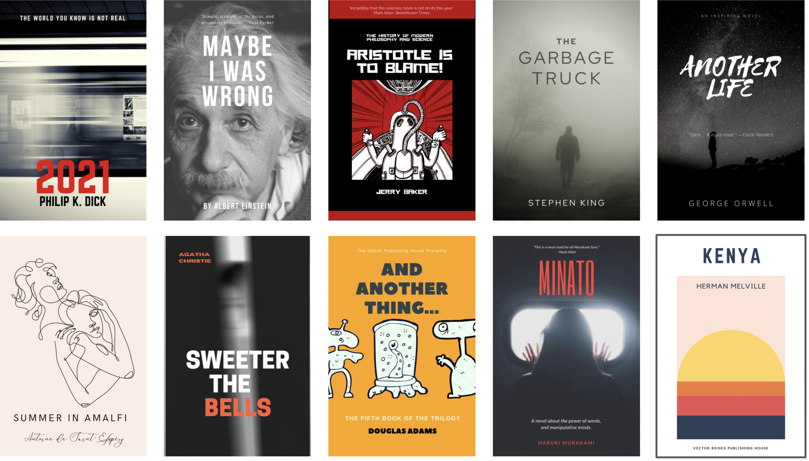

# Books that don't exist

## 2021 (Philip K. Dick)

Set in the year 2021, this novel describes a society in which individuals are embedded in a virtual reality machine called "the world." In this world, all past, present and future events are stored as a 3-D hologram from which the individual can access any time and place in history. The novel begins with the main character, Douglas Spaulding, waking up in a hospital, after an accident that left him in a coma for two years. This accident also left him with retrograde amnesia, and he has no recollection of his previous life. The doctors explain that, due to the accident, he has lost the ability to keep track of time and has begun to live backwards, beginning with the present and moving backwards towards the past. Spaulding is also surprised to discover that he is now married to his former girlfriend, who is now an old woman who looks to be in her 80s. The novel describes what happens as Spaulding and his wife try to adjust to this new reality.

## The Garbage Truck (Stephen King)

The vehicle is a garbage truck, but not like any other garbage truck. It's big and black and looks like a locomotive. It runs on diesel fuel, its gears are stripped, and it belches exhaust. The truck visits the alley every night, but only when it's dark. When it comes, the garbage men are ready. The garbage men are three boys, not more than seventeen, who take whatever they can get their hands on. They are poor, but they are not humble. The garbage truck only comes at night. It collects garbage, but not garbage like you're used to. It collects people.

## Minato (Haruki Murakami)

Minato can read minds and use her powers to manipulate the thoughts of the people around her. She entices people into believing what she wants them to believe and can even help them to change their personalities if she wants to. However, Minato is not a nice person. In fact, she uses her power as a weapon, manipulating people to suit her own agenda. In this novel, Murakami, one of Japan's most famous authors, illustrates the power of suggestion and the effects it can have on those who are manipulated.

## Aristotle Is To Blame! (Jerry Baker)
A satirical tale of the famous philosopher of Ancient Greece, Aristotle, who is credited with laying the foundation of Western Philosophy. He is said to have invented many of the sciences, but in this story, he is portrayed as a bumbling,  imbecile person who teaches people of his time about the sciences, but does not understand the concepts himself.

## Kenya (Herman Melville)

Set in the 19th century, this short story is about a safari trip of two European gentlemen to Africa. The tale focuses on their hunting expedition and brings out contrasts between their perceptions and actuality of the events and the people they encounter. It is a study of the cruelty of man and his fascination with destruction.

## Summer in Amalfi (Antoine de Saint-Exupéry)

A short story about two friends: the narrator and a man named Jean. The narrator and his friend Jean fly to Italy and spend their time there eating and drinking and generally having a good time. After a while, Jean decides to go back to France, and the narrator decides to stay in Italy alone. As time passes, the narrator realizes that he is alone and begins to question his life and his decisions.

## Maybe I Was Wrong (Albert Einstein)

This autobiography tells the story of his life, beginning with his birth in Germany in 1879 up until the time that he wrote the book in 1930. Einstein tells of his struggles in his early years in school, his failed attempts at working in the field of study he believed he was naturally inclined towards, and the events which led up to his migration to the United States in the early 1900s.

## Another Life (George Orwell)

This novel is about a universe where dogs have evolved into the dominant species. The main character, a dog named Major, finds a book written by a human called Paldonsowitz. He realizes that the contents of the book are not compatible with his view of the world and sets out to find the author. He is determined to learn if the dog society is really the best one possible.

## Sweeter The Bells (Agatha Christie)

The story is about a murder that happens during a Christmas market in a town called St. Mary Mead. The victim is a man called Horace Blatt. The police are not successful in solving the murder and find themselves at a dead end. The only person who saw the killer is a woman named Miss Marple. She is not exactly willing to become involved in the case, but in the end she is the person who helps the police identify the killer.

## And Another Thing... (Douglas Adams)

This book is the fifth in the Hitchhiker's Guide series. Arthur Dent, who in the previous book in the series was once again saved by the space ship Heart of Gold. In this book, he is trying to enjoy his golden years, but is soon dragged into an adventure when he is mistaken for the son of the man who the Vogons are looking for in connection with the destruction of the Earth.
